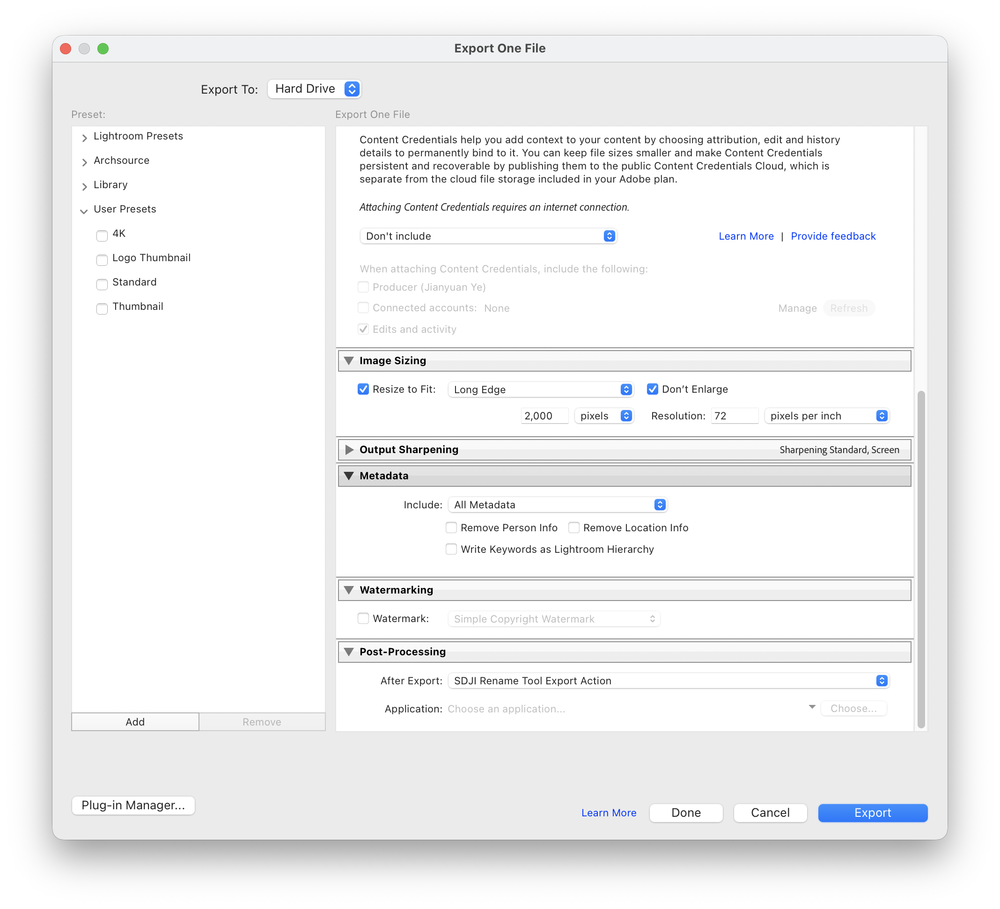

# SDJI Rename Tool

一个给 DJI 图片文件批量改名的 macOS 小工具，支持独立 App、命令行和 Adobe Lightroom Classic 导出后自动改名。代码和文案全部由 CodeX 完成。

做这个工具的初衷很简单：DJI 的文件名太太太长了，而且经常混着时间戳、`_D`、`-HDR`、`-T` 这类标记。Finder 里没有一个舒服的机械替换方式，Lightroom 导出后手动改也很烦，所以做了这么个工具。




它是原生 macOS App，体积很小，不需要 Python 或额外运行环境。配置只保存一份：

```text
~/Library/Application Support/SDJI Rename Tool/config.json
```

## 功能

- 拖入图片文件夹
- Lightroom CC / Classic 导出后自动改名并打开导出文件夹
- 命令行调用同一套 App 规则
- 预览 `原文件名 -> 新文件名`
- 自定义图片格式
- 清理 DJI 文件名里的时间戳
- 删除 `_D`、`-D`、`-HDR`、`-EDIT` 等标记
- 可配置保留标记，比如 `-T`、`-L`
- 重复文件名处理：
  - `name-2.jpg`
  - `name (2).jpg`
  - `name_2.jpg`
  - 跳过冲突文件
- 应用改名
- 撤销上次改名
- 保存规则配置

## Lightroom CC / Classic

安装 Export Action 后，在 Lightroom 导出窗口底部选择：

```text
Post-Processing -> After Export -> SDJI Rename Tool Export Action
```

Lightroom 导出完成后会把本次导出的文件交给 `SDJI Rename Tool.app`，工具只处理这些文件，不会扫描整个导出目录。改名完成后会短暂等待并自动打开导出文件夹，适合 Lightroom CC 不能叠加多个后处理动作的场景。

推荐在 App 左侧 `Lightroom CC Export Action` 区域点击 `安装` 或 `更新`。如果 Lightroom 使用了特殊位置，点击 `选择 App/目录`，可以选择 `Lightroom CC.app` 本体，也可以选择 Export Actions 文件夹后再安装；选择 `.app` 时会自动写入它内部的 Export Actions 目录。

也可以用脚本安装/更新：

```bash
scripts/install_lightroom_export_action.sh "/Applications/SDJI Rename Tool.app/Contents/MacOS/SDJI Rename Tool"
```

Export Action 会安装到：

```text
~/Library/Application Support/Adobe/Lightroom/Export Actions/
```

## 命令行

命令行入口保留，但实际执行会转发到 `SDJI Rename Tool.app`，和 GUI、Lightroom 使用同一份配置。

```bash
pic-rename --path /path/to/images --dry-run
pic-rename --path /path/to/images
pic-rename --undo-last
pic-rename --config-path
```

App 也可以直接调用：

```bash
"/Applications/SDJI Rename Tool.app/Contents/MacOS/SDJI Rename Tool" --rename-folder /path/to/images
"/Applications/SDJI Rename Tool.app/Contents/MacOS/SDJI Rename Tool" --lightroom-export file1.jpg file2.jpg
```

## 默认规则示例

```text
DJI_20240123142524_0486_D.JPG
-> DJI_0486.JPG

0730-DJI_20240730173246_0047_D-T.JPG
-> 0730-DJI_0047-T.JPG
```

如果把 `-T` 从保留标记中移除：

```text
0730-DJI_20240730173246_0047_D-T.JPG
-> 0730-DJI_0047.JPG
```

## 安装

下载：

```text
SDJI-Rename-Tool-mac-arm64.zip
```

解压后把 `SDJI Rename Tool.app` 拖到 `Applications` 即可。

如果 macOS 首次打开提示安全限制，可以在 Finder 中右键 App，选择“打开”。

## 开发构建

需要 Xcode 或 Xcode Command Line Tools。

构建：

```bash
cd swift/SDJIRenameTool
./build_app.sh
```

产物：

```text
dist-swift/SDJI Rename Tool.app
dist-swift/SDJI Rename Tool-swift-mac-arm64.zip
```

## 项目结构

```text
swift/SDJIRenameTool/Package.swift
swift/SDJIRenameTool/Sources/SDJIRenameTool/
swift/SDJIRenameTool/build_app.sh
scripts/install_lightroom_export_action.sh
screenshots/app.png
screenshots/lightroom-export-action.png
```

## License

MIT
