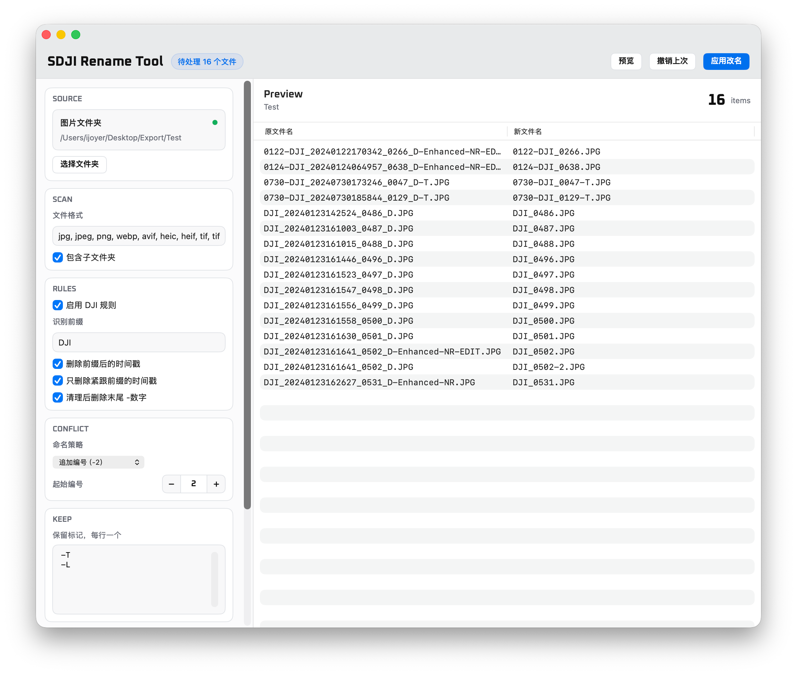

# SDJI Rename Tool

一个给 DJI 图片文件批量改名的 macOS 小工具。

做这个工具的初衷很简单：DJI 的文件名太太太长了，而且经常混着时间戳、`_D`、`-HDR`、`-T` 这类标记。Finder 里没有一个舒服的机械替换方式，手动改又很烦，所以做了这么个拖进去、先预览、再改名的小工具。



它是原生 macOS App，体积很小，不需要 Python 或额外运行环境。

## 功能

- 拖入图片文件夹
- 预览 `原文件名 -> 新文件名`
- 自定义图片格式
- 清理 DJI 文件名里的时间戳
- 删除 `_D`、`-D`、`-HDR`、`-EDIT` 等标记
- 可配置保留标记，比如 `-T`、`-L`
- 重复文件名处理：
  - `name-2.jpg`
  - `name (2).jpg`
  - `name_2.jpg`
  - 跳过冲突文件
- 应用改名
- 撤销上次改名
- 保存规则配置

## 默认规则示例

```text
DJI_20240123142524_0486_D.JPG
-> DJI_0486.JPG

0730-DJI_20240730173246_0047_D-T.JPG
-> 0730-DJI_0047-T.JPG
```

如果把 `-T` 从保留标记中移除：

```text
0730-DJI_20240730173246_0047_D-T.JPG
-> 0730-DJI_0047.JPG
```

## 安装

下载：

```text
SDJI-Rename-Tool-mac-arm64.zip
```

解压后把 `SDJI Rename Tool.app` 拖到 `Applications` 即可。

如果 macOS 首次打开提示安全限制，可以在 Finder 中右键 App，选择“打开”。

## 开发构建

需要 Xcode 或 Xcode Command Line Tools。

构建：

```bash
./build_app.sh
```

产物：

```text
dist/SDJI Rename Tool.app
dist/SDJI-Rename-Tool-mac-arm64.zip
```

## 项目结构

```text
Package.swift
Sources/SDJIRenameTool/
build_app.sh
screenshots/app.png
SDJI-Rename-Tool-mac-arm64.zip
```

## License

MIT
